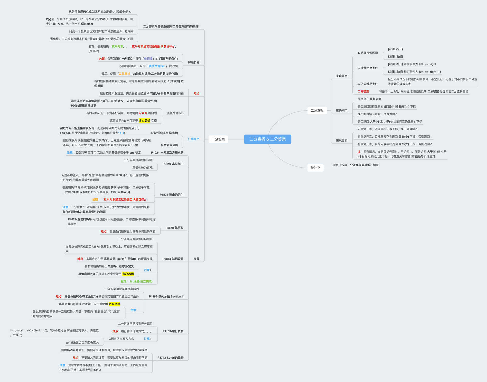

二分查找-java算法模版
<!-- more -->

## 零、二分查找 & 二分答案算法全景图


## 一、二分查找-算法模版
```java
// 二分查找标准模版
// 二分查找主要有以下3种实现方式
// 1. [左闭, 右开)
// 2. [左闭, 右闭]
// 3. 二分答案写法
/**
 * 二分查找要点
 * 1. 明确搜索区间
 *   1.1 [左闭, 右开)
 *   1.2 [左闭, 右闭]
 * 2. 清楚结束条件
 *  搜索区间决定结束条件
 *  [左闭, 右开) 结束条件为 left == right
 *  [左闭, 右闭] 结束条件为 left == right + 1
 * 3. 区分越界条件
 *  区分不同情况下的越界判断条件，不宜死记，可基于对不同情况二分查找逻辑的理解确定
 * 在融汇以上3点的情况下，可写出不同情况下的二分查找算法，也可基于思维难度更低的 二分答案 思想实现算法
 * @author RaySunWHUT
 * @Date 2023-07-12 09:37
 */
public class Main {
    /**
     * 搜索区间: [左闭, 右闭]
     * 返回目标元素 target 最小(左)下标(第一次出现位置)
     * @param arr
     * @param target
     * @return
     */
    public int findLeftClosed(int[] arr, int target) {
        // 1. 搜索区间: [left, right]
        int left = 0;
        int right = arr.length - 1;

        // 2. 结束条件: left = right + 1
        while (left <= right) {
            int mid = left + (right - left) / 2;
            if (arr[mid] > target) { // 在 mid 的左侧区间 [left, mid - 1] 搜素
                right = mid - 1;
            } else if (arr[mid] < target) { // 在 mid 的右侧区间 [mid + 1, right] 搜素
                left = mid + 1;
            } else if (arr[mid] == target) { // 为清晰逻辑, 等于(==)目标元素时的分支也要写清楚
                right = mid - 1;
            }
        }

        // 左右均会越界, 关键看返回什么
        // 2种越界情况:
        // 1. 目标元素 大于(>) 元素序列的所有元素时(left == arr.length, right == arr.length - 1), 返回 -1
        // 2. 目标元素 小于(<) 元素序列的所有元素时(left == 0, right == -1), 返回 -1
        // 为提高程序健壮性 和 方便记忆, 最好写成 if (left >= arr.length || right < 0), 此处是为了清晰程序的可达性
        if (left >= arr.length) {
            return -1;
        }

        // 目标元素存在时, 返回元素最小(左)下标; 目标元素不存在时, 返回 大于(>) 目标元素的元素的最小(左)下标
        // 注: 由于 left = right + 1, 故也可返回 right + 1
//        return left;

        // 目标元素存在时, 返回元素最小(左)下标; 目标元素不存在时, 返回 -1
        // 此处, left 可替换为 right + 1
        return arr[left] == target ? left : -1;
    }


    /**
     * 搜索区间: [左闭, 右闭]
     * 返回目标元素 target 最大(右)下标(最后一次出现位置)
     * @param arr
     * @param target
     * @return
     */
    public int findRightClosed(int[] arr, int target) {
        // 1. 搜索区间: [left, right]
        int left = 0;
        int right = arr.length - 1;

        // 2. 结束条件: left = right + 1
        while (left <= right) {
            int mid = left + (right - left) / 2;
            if (arr[mid] > target) { // 在 mid 的左侧区间 [left, mid - 1] 搜素
                right = mid - 1;
            } else if (arr[mid] < target) { // 在 mid 的右侧区间 [mid + 1, right] 搜素
                left = mid + 1;
            } else if (arr[mid] == target) {
                left = mid + 1;
            }
        }

        // 左右均会越界, 关键看返回什么
        // 2种越界情况:
        // 1. 目标元素 大于(>) 元素序列的所有元素时(left == arr.length, right == arr.length - 1), 返回 -1
        // 2. 目标元素 小于(<) 元素序列的所有元素时(left == 0, right == -1), 返回 -1
        // 为提高程序健壮性 和 方便记忆, 最好写成 if (left >= arr.length || right < 0), 此处是为了清晰程序的可达性
        if (right < 0) {
            return -1;
        }

        // 目标元素存在时, 返回元素最大(右)下标; 目标元素不存在时, 返回 小于(<) 目标元素的元素的最大(右)下标
        // 注: 由于 left = right + 1, 故也可返回 left - 1
//        return right;

        // 目标元素存在时, 返回元素最大(右)下标; 目标元素不存在时, 返回 -1
        // 此处, right 可替换为 left - 1
        return arr[right] == target ? right : -1;
    }


    /**
     * 搜索区间: [左闭, 右开)
     * 返回目标元素最小(左)下标(第一次出现位置)
     * @param arr
     * @param target
     * @return
     */
    public int findLeftOpen(int[] arr, int target) {
        // 1. 搜索区间: [left, right)
        int left = 0;
        int right = arr.length;

        // 2. 结束条件: left == right, 此时搜索区间为[left, left), 可正确终止
        while (left < right) {
            int mid = left + (right - left) / 2;
            if (arr[mid] > target) { // 在 mid 的右侧区间 [mid + 1, right) 搜索
                right = mid;
            } else if (arr[mid] < target) { // 在 mid 的左侧区间 [left, mid) 搜素
                left = mid + 1;
            } else if (arr[mid] == target) {
                right = mid;
            }
        }

        // 返回left时, 只有右边界会越界
        // 1种越界情况:
        // 1. 目标元素 大于(>) 元素序列的所有元素时(left == right == arr.length), 返回 -1
        // 由于结束条件是left == right, 故此处left可替换为right
        // 两种不同写法的理解:
        // 此处写成 left >= arr.length, 含义是left逐渐逼近元素序列右边界, 直至与right相等
        // 此处写成 right >= arr.length, 含义是right始终保持不动, left逐渐逼近, 直至两者相等
        if (left >= arr.length) {
            return -1;
        }

        // 目标元素存在时, 返回元素小(左)下标; 目标元素不存在时, 返回 大于(>) 目标元素的元素的最小(左)下标
        // 注: 由于 left == right, 故也可返回 right
//        return left;

        // 目标元素存在时, 返回元素最小(左)下标; 目标元素不存在时, 返回 -1
        return arr[left] == target ? left : -1;
    }


    /**
     * 搜索区间: [左闭, 右开)
     * 返回目标元素最大(右)下标(最后一次出现位置)
     * 注意⚠️: 搜索区间[左闭, 右开)的情况下, 返回值较为特殊, 需特别记忆！
     * @param arr
     * @param target
     * @return
     */
    public int findRightOpen(int[] arr, int target) {
        // 1. 搜索区间: [left, right)
        int left = 0;
        int right = arr.length;

        // 2. 结束条件: left == right, 此时搜索区间为[left, left), 可正确终止
        while (left < right) {
            int mid = left + (right - left) / 2;
            if (arr[mid] > target) { // 在 mid 的左侧区间 [left, mid) 搜素
                right = mid;
            } else if (arr[mid] < target) { // 在 mid 的左侧区间 [mid + 1, right) 搜素
                left = mid + 1;
            } else if (arr[mid] == target) {
                left = mid + 1;
            }
        }

        // 返回left - 1时, 只有左边界会越界(此处需特别注意⚠️: 由于 arr[mid] == target 时, left = mid + 1, 所以满足条件的 mid = left - 1, 故需要返回 left - 1)
        // 1种越界情况:
        // 1. 目标元素 小于(<) 元素序列的所有元素时(left == right == 0), 返回 -1
        // 虽然会出现 left == right == arr.length 的情况, 但此处返回 left - 1, 所以不会触发越界情况
        // 虽然结束条件是left == right, 但此处返回 left - 1 更具逻辑性
        if (left - 1 < 0) {
            return -1;
        }

        // 目标元素存在时, 返回元素最大(右)下标; 目标元素不存在时, 返回 小于(<) 目标元素的元素的最大(右)下标
        // 注: 由于 left == right, 故也可返回 right - 1
//        return left - 1;

        // 目标元素存在时, 返回元素最大(右)下标; 目标元素不存在时, 返回 -1
        return arr[left - 1] == target ? left - 1 : -1;
    }


    /**
     * 具备 "单调性" 的真值命题P(x)
     * @param arr
     * @param target
     * @param mid
     * @return
     */
    private boolean f(int[] arr, int target, int mid) {
        return arr[mid] >= target;
    }


    /**
     * 二分答案思想实现二分查找(关键在于思想)
     * 注意⚠️: 可通过修改 "真值命题P(x)" 的方法逻辑以及 "分界点" 两侧的处理逻辑, 适配不同搜索区间的不同情况
     * 使用二分答案写法思维难度更低，此处只举例说明 "搜索区间 为 [左闭, 右开) 查找目标元素左边界" 的情况，其他情况同理
     * e.g.
     * 搜索区间: [左闭, 右开)
     * 返回目标元素最大(右)下标(最后一次出现位置)
     * @param arr
     * @param target
     * @return
     */
    public int findLeftOpenAns(int[] arr, int target) {
        int left = 0;
        int right = arr.length;

        int ans = -1;
        while (left < right) {
            int mid = left + (right - left) / 2;
            if (f(arr, target, mid)) {
                // 二分答案思想
                ans = mid;
                right = mid;
            } else {
                left = mid + 1;
            }
        }

        // 返回left时, 只有右边界会越界
        // 1种越界情况:
        // 1. 目标元素 大于(>) 元素序列的所有元素时(left == right == arr.length), 返回 -1
        // 由于结束条件是left == right, 故此处left可替换为right
        // 两种不同写法的理解:
        // 此处写成 left >= arr.length, 含义是left逐渐逼近元素序列右边界, 直至与right相等
        // 此处写成 right >= arr.length, 含义是right始终保持不动, left逐渐逼近, 直至两者相等
        if (left >= arr.length) {
            return -1;
        }

        // 目标元素存在时, 返回元素小(左)下标; 目标元素不存在时, 返回 大于(>) 目标元素的元素的最小(左)下标
//        return ans;

        // 目标元素存在时, 返回元素最小(左)下标; 目标元素不存在时, 返回 -1
        return arr[ans] == target ? ans : -1;
    }


    public static void main(String[] args) {
//        int[] arr = new int[]{1, 2, 2, 4, 7, 9, 9, 9, 13};
        int[] arr = new int[]{2, 2, 4, 7, 9, 9, 9, 13};
//        int[] arr = new int[]{1, 2, 2, 4, 7, 9, 9, 9};

        Main binarySearch = new Main();
        int[] targets = new int[]{0, 2, 4, 9, 13, 20};

        System.out.println("=== 寻找目标元素左边界 ===");
        // 寻找目标元素左边界
        for (int target : targets) {
            int idx = binarySearch.findLeftClosed(arr, target);
            System.out.println("idx: " + idx);
        }
        for (int target : targets) {
            int idx = binarySearch.findLeftOpen(arr, target);
            System.out.println("idx: " + idx);
        }
        for (int target : targets) {
            int idx = binarySearch.findLeftOpenAns(arr, target);
            System.out.println("idx: " + idx);
        }


        System.out.println("=== 寻找目标元素右边界 ===");
        // 寻找目标元素左边界
        for (int target : targets) {
            int idx = binarySearch.findRightClosed(arr, target);
            System.out.println("idx: " + idx);
        }
        for (int target : targets) {
            int idx = binarySearch.findRightOpen(arr, target);
            System.out.println("idx: " + idx);
        }
    }
}
```
注：有空可补充 [灵山府二分文章](https://leetcode.cn/problems/search-in-rotated-sorted-array/solutions/1987503/by-endlesscheng-auuh/)

## 二、参考文献
1. https://leetcode.cn/problems/search-in-rotated-sorted-array/solutions/1987503/by-endlesscheng-auuh/
2. https://labuladong.github.io/algo/di-ling-zh-bfe1b/wo-xie-le--3c789/
