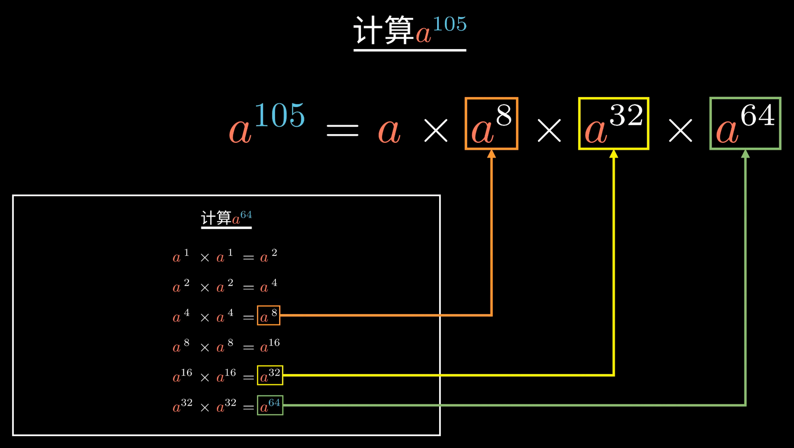
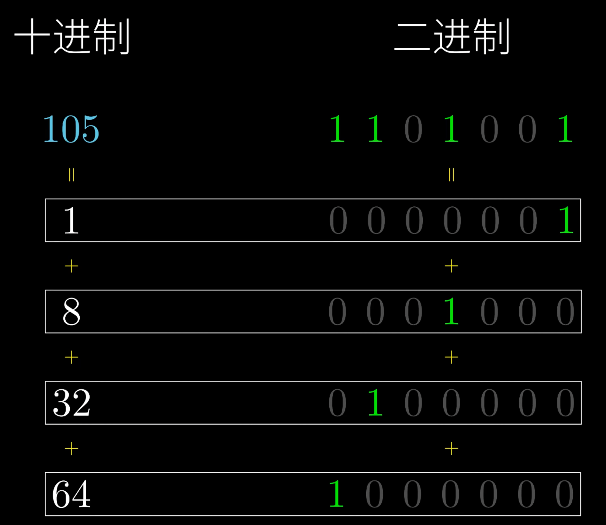
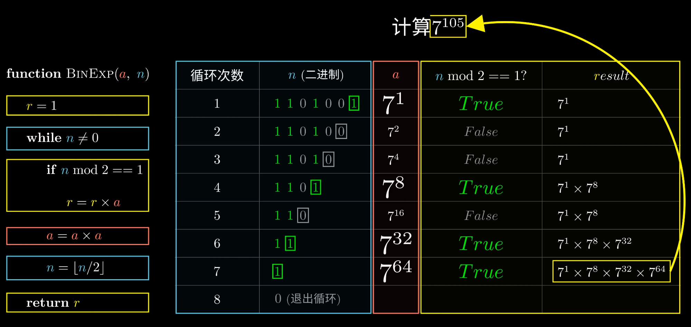
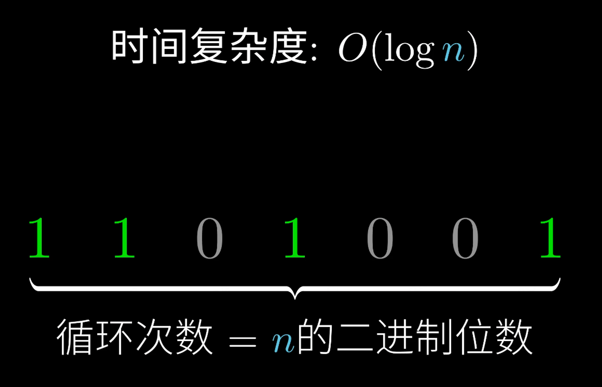
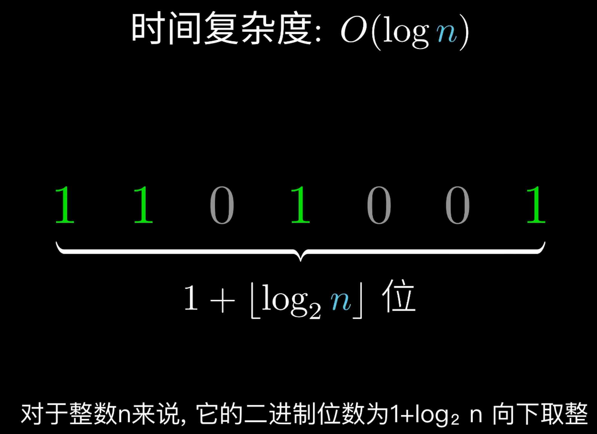

描述快速幂算法原理
<!-- more -->

## 一、快速幂基本原理
**基本原理**：幂次分解
$$ a^{105} = a^{1} * a^{8} * a^{32} *  a^{64} $$






## 1.1、快速幂时间复杂度
1. 快速幂时间复杂度: $O(log_{2}^{n})$ 


2. 整数n的二进制位数 为 $1 + \lfloor log_{2}^{n} \rfloor$


### 1.3、快速幂-C++实现
题源: [牛客-JZ16](https://www.nowcoder.com/practice/1a834e5e3e1a4b7ba251417554e07c00?tpId=13&tqId=23277&ru=%2Fpractice%2F00de97733b8e4f97a3fb5c680ee10720&qru=%2Fta%2Fcoding-interviews%2Fquestion-ranking&sourceUrl=)
```cpp
class Solution {
public:
    // 题目描述: 
    // 实现函数 double Power(double base, int exp)，求base的exp次方
    // 注: exp可能为负
    double Power(double base, int exp) {
        double res = 1;
        
        // 处理exp为负的情况
        int pow = exp < 0 ? -1 * exp : exp;
        while (pow != 0) {
            if ((pow & 1) == 1) {
                res *= base;
            }
            pow >>= 1;
            base *= base;
        }
        return exp < 0 ? 1.0 / res : res;
    }
};
```


## 二、快速幂应用
### 2.1、应用1-幂取模
$$ 计算\quad a^n \quad mod \quad m $$

```cpp
#include<iostream>
#include<cmath>
#include<cstdio>
#include<algorithm>
#include<string>
#include<set>
#include<unordered_set>
#include<vector>
#include<climits>
#include<limits>
#include<map>
#include<unordered_map>
#include<string.h>

using namespace std;

int main() {
  long long a, n, m;
  cin >> a >> n >> m;

  long long r = 1;
  while (n != 0) {
    // &运算 需要加 括号()
    if ((n & 1) == 1) {
      r = r * a % m;
    }
    a = a * a % m;
    n = n >> 1;
  }

  cout << r << endl; 
  return 0;
}
```

### 2.2、应用2 [麦森数](https://www.luogu.com.cn/problem/P1045)

```cpp
#include<iostream>
#include<cmath>
#include<cstdio>
#include<algorithm>
#include<string>
#include<set>
#include<unordered_set>
#include<vector>
#include<climits>
#include<limits>
#include<map>
#include<unordered_map>
#include<string.h>
#include<queue>

using namespace std;

int res[500];
int lenRes = 0;
void multiple(int arr[], int lenArr, int nums[], int lenNum) {
  int lenA = lenArr + lenNum;
  int a[lenA];
  memset(a, 0, sizeof(a));
  for (int i = 0; i < lenArr; i++) {
    for (int j = 0; j < lenNum; j++) {
      a[i + j] += arr[i] * nums[j];
    }
  }

  for (int i = 0; i < lenA - 1; i++) {
    a[i + 1] += a[i] / 10;
    a[i] %= 10;
    if (i < 500) {
      res[i] = a[i];
    } else {
      break;
    }
  }

  lenRes = lenA >= 500 ? 500 : lenA;
}


int arr[500];
int lenArr = 0;
// 求解数字a的N次方(高精度)
void compute(int* a, int* b, int lenA, int lenB) {
  int len = lenA + lenB;
  int c[len];
  memset(c, 0, sizeof(c));
  for (int i = 0; i < lenA; i++) {
    for (int j = 0; j < lenB; j++) {
      c[i + j] += a[i] * b[j];
    }
  }

  for (int i = 0; i < len - 1; i++) {
    c[i + 1] += c[i] / 10;
    c[i] %= 10;
    if (i < 500) {
      arr[i] = c[i];
    } else {
      break;
    }
  }

  lenArr = len >= 500 ? 500: len;
}


int main() {
  int p;
  cin >> p;

  int bits = p * log10(2) + 1;
  cout << bits << endl;

  memset(res, 0, sizeof(res));
  res[0] = 1;
  lenRes = 1;

  memset(arr, 0, sizeof(arr));
  arr[0] = 2;
  lenArr = 1;
  
  // 快速幂
  while (p != 0) {
    if ((p & 1) == 1) {
      multiple(arr, lenArr, res, lenRes);
    }
    compute(arr, arr, lenArr, lenArr);
    p >>= 1;
  }


  res[0] -= 1;
  for (int i = 500 - 1; i >= 0; i--) {
    cout << res[i];
    if (i % 50 == 0) {
      cout << endl;
    }
  }
  return 0;
}
```

## 三、参考文献
1. https://www.bilibili.com/video/BV16Z4y1M7y1/?share_source=copy_web&vd_source=e9988d180a03a7b167558e2688c4362b
2. https://www.luogu.com.cn/blog/80614/solution-p1226
