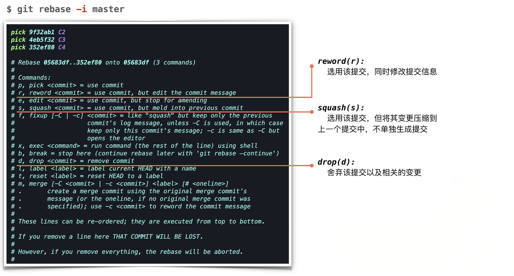

::: note 浅析git rebase命令的作用、使用方法、适用场景以及和merge命令的区别 
:::
<!-- more -->

## 一、文章梗概


## 二、rebase(变基)与merge(合并)区别
在开发过程中，经常遇到的一个场景是要将个人开发的feature分支 **pull request** 到master分支，但master分支又已经有了新的变更，pull request存在代码冲突(conflict)。面对这种情况通常有2种处理方式: 
1. 将master分支的最新提交 **合并(merge)** 到feature分支， **合并(merge)** 过程中解决冲突。
2. 在feature分支上执行 **变基(rebase master)**，**变基(rebase master)** 过程中解决冲突。 


**合并(merge)** 操作会执行三路合并(**c1、c4、c6**)，并在feature分支生成一个合并后的新commit提交节点(**c7**)。
分支的合并痕迹可在git graph(执行命令 **`git log --oneline --graph --decorate`**)查看。

**变基(rebase)** 操作会将feature分支的commit提交节点暂存下来，并以master分支的最新提交(HEAD)为新的**基(base)**，将暂存下的commit提交节点接到新的 **基(base)** 上，实现 **变基(rebase)操作**(**c1 -> c6**)。
可以看到，**rebase操作没有新增commit提交**，并且即使通过git graph查看也感知不到有将master分支最新提交整合至feature分支的操作。

由于代码评审时，commit提交节点愈清晰愈好，且不应在feature分支增加不属于feature分支本身的commit提交；**所以，在整合个人开发的feature分支时，推荐使用rebase，而非merge**。

<font color="#C3002E"><b>注</b></font>: 只要冲突(conflict)处理方式相同，那么分别执行 **merge(c7)** 和 **rebase(c4')** 后的节点内容是完全相同的。

## 三、交互式rebase
在日常开发中，rebase操作的正确使用姿态是 —— **使用交互式rebase**，使用交互式rebase可以让操作执行者参与到git rebase操作的整个过程，更加精确的实现commit提交的压缩、拆分、重排、修改和丢弃等操作。

### 3.1、rebase操作命令
在feature分支上执行 **`git rebase -i master`** 后会出现如下内容：

其中 **c2、c3、c4** 分别表示feature分支创建后的3次新commit提交。
通过修改文件内容可以实现：
1. **调整commit提交顺序**
  

2. **销毁某次commit提交(drop)**
  
3. **合并多个commit提交(squash)**
   squash命令会将当前commit提交合并(压缩)到上一个commit提交中，合并后的“新”commit提交会有新的commit哈希值。
   
4. **修改commit提交的描述信息(reword)**   
5. **修改commit提交的描述信息和内容(edit)**
6. 不希望真正执行变基, 但又需要整理commit提交历史的场景(**伪变基**)

可根据实际情况将上述操作结合使用


### 3.2、rebase: edit命令与reword命令区别
- **reword**：
  使用 **reword** 命令，可以修改提交的描述信息(msg)，但无法修改提交内容。
  使用 **reword** 命令时，git会打开一个编辑器，可在编辑器内修改commit提交的描述信息。完成后，git会创建一个替换原commit提交的hash值不同的“新”提交。
- **edit**：
  使用 **edit** 命令，可以修改提交的描述信息(msg)以及提交内容。
  **edit命令不同使用场景处理方法**：
    1. 没有修改commit提交内容(如新增、修改和删除文件内容等)，但要修改commit提交的描述信息(msg)
    **处理方法**: 此时只能通过 **`git commit --amend`** 修改提交描述信息。
    2. 修改了commit提交内容(已通过 **`git add`** 添加至 **暂存区(stage)**)，同时要修改commit提交的描述信息(msg)
    **处理方法(2种)**:
       1. 执行 **`git commit --amend`** 修改提交描述信息，然后执行 **`git rebase --continue`** 命令继续rebase操作。
       2. 直接执行 **`git rebase --continue`** 命令，如果之前没有执行过 **`git commit --amend`** 命令，则git会打开一个编辑器，可在编辑器内修改commit提交的描述信息。
  
  **补充说明**：
    使用 **edit** 命令时，git 会暂停 rebase 过程，并将当前分支的 **HEAD** 指向选中提交。此时，可以使用 **`git commit --amend`** 命令修改选中提交的描述信息。 
    <font color="#C3002E"><b>注</b></font>: **--amend** 参数项只能修改 **最近一次提交(HEAD)** 的描述信息，但由于 **HEAD** 此时正指向 **edit** 命令对应的提交，所以，可以使用 **--amend** 参数项。

## 四、场景实践
### 4.1、伪变基-修改指定分支的commit提交描述信息(reword)
```bash
# 命令解释:
# commitId: 要修改提交信息的commit提交的哈希值
# ~1: git引用操作符，表示选择该提交的父提交作为基来进行伪变基操作
git rebase -i [commitId]~1
```

e.g. 修改commitId为 1c6ce75 的提交描述信息


操作流程如下: 


### 4.2、标记commit提交，实现rebase自动编排
```bash
# 命令解释:
# 使用 --fixup 或 --squash 参数项可对commit提交进行额外标记
git commit --fixup=[commitId] -m "提交描述信息"
git commit --squash=[commitId] -m "提交描述信息"

# 使用 --autosquash 参数项可对已标记的commit提交自动完成指令组装，将有标记的commit提交合并(压缩)到 --fixup 或 --squash 参数项对应的commit提交
git rebase -i [commitId] --autosquash
```


## 五、rebase优缺点
### 优点
1. 整合master分支时，不会增加不属于feature分支本身的提交
2. rebase可以使分支的提交历史变得整洁
3. 可以使用交互式rebase，更加精确的实现commit提交的压缩、拆分、重排、修改和丢弃等操作，掌控代码开发的全流程

### 缺点
1. rebase会更改git提交历史，使得git操作历史难以回溯
2. 在公共分支上执行rebase可能会导致提交日志记录发生混乱(相同作者、时间、内容的commit重复出现等情况)


## 六、使用法则
在个人开发的feature分支上执行 **rebase(变基)**，在公共分支上执行 **merge(合并)**。
<font color="#C3002E"><b>注</b></font>: **永远不要在多人协作(已被其他人引用)的公共分支(e.g. master分支)上执行rebase！！**


## 七、参考文献
1. https://www.bilibili.com/video/BV1Xb4y1773F/?spm_id_from=333.788