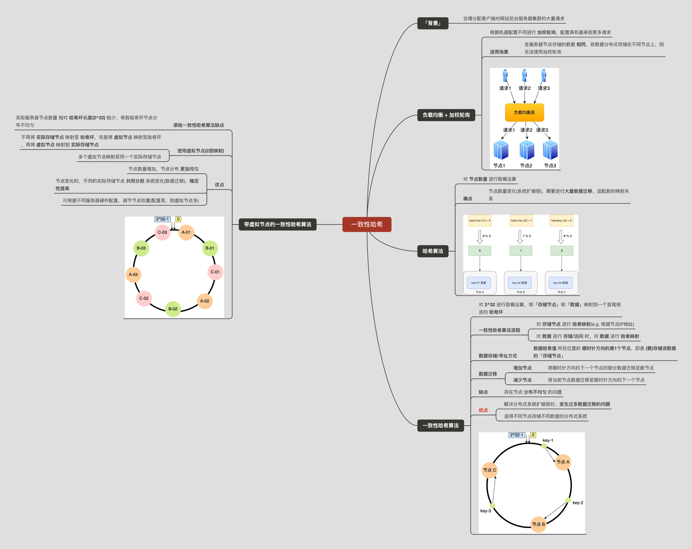

描述一致性哈希算法的基本原理
<!-- more -->

## 零、一致性哈希算法-思维导图

## 一、问题背景
在客户端请求量较大时，如何合理分配客户端对网站后台服务器集群的大量请求

## 二、解决方案
### 2.1、负载均衡层 + 加权轮询

**使用场景**：每个节点存储的数据相同的情况，若数据分布式的存储在不同的节点的上，则无法使用加权轮询。

### 2.2、哈希算法
对节点数量进行取模运算。
**痛点**：若节点数量发生变化，即在对系统做扩容或者缩容时，必须迁移改变了映射关系的数据。否则会出现查询不到数据的问题。

### 2.3、一致性哈希算法
**一致性哈希** 是指将「**存储节点**」和「**数据**」都映射到一个首尾相连的哈希环上。

一致性哈希算法对2^32进行取模运算，由2^32个点组成 **哈希环**。

一致性哈希算法流程：

1. 对 **存储节点** 进行哈希
2. 对 **数据** 存取进行哈希

在一致性哈希算法中，若 **增加** 或 **移除** 一个节点，仅影响该节点在哈希环上顺时针相邻的后继节点，其余数据不受影响。

**存在问题**

一致性哈希算法虽然减少了数据迁移量，但存在节点分布不均匀的问题。

### 2.4、带虚拟节点的一致性哈希算法

改为「**两层**」映射，**目的** 是 **让节点相对均匀的分布在哈希环(节点数量越多，在哈希环上的分布就越均匀)**。

1. 不再将 **真实节点** 映射到哈希环上。
2. 将 **虚拟节点** 映射到哈希环上，并将 **虚拟节点** 映射(→) 到 **实际节点**。

**FAQ**：使用 **带虚拟结点** 的一致性hash算法后，每次 新增/删除 物理机，都会 引入、剔除大量虚拟结点，那么数据迁移量不是更大了嘛 ?

**ans**：引入虚拟结点后，在增删物理机时，虽然迁移的虚拟结点数量增多了，但两个虚拟结点间的 ”**段长**” 更短了；同时，无论是否使用带虚拟结点的一致性hash算法，机器上的总数据量是不变的，故迁移的数量是不变的，只是“带虚拟结点”的一致性hash算法会让数据分布的更均匀。

## 三、一致性哈希算法实现
可参考labuladong的[一致性hash算法实现](https://mp.weixin.qq.com/s/zL-n7zq0Zyhf-l_GQil2dg)

## 四、参考文献
1. https://xiaolincoding.com/os/8_network_system/hash.html#_9-4-%E4%BB%80%E4%B9%88%E6%98%AF%E4%B8%80%E8%87%B4%E6%80%A7%E5%93%88%E5%B8%8C
2. https://mp.weixin.qq.com/s/zL-n7zq0Zyhf-l_GQil2dg