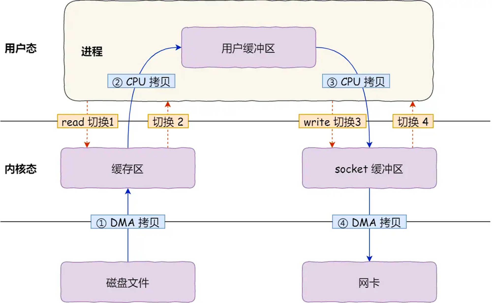
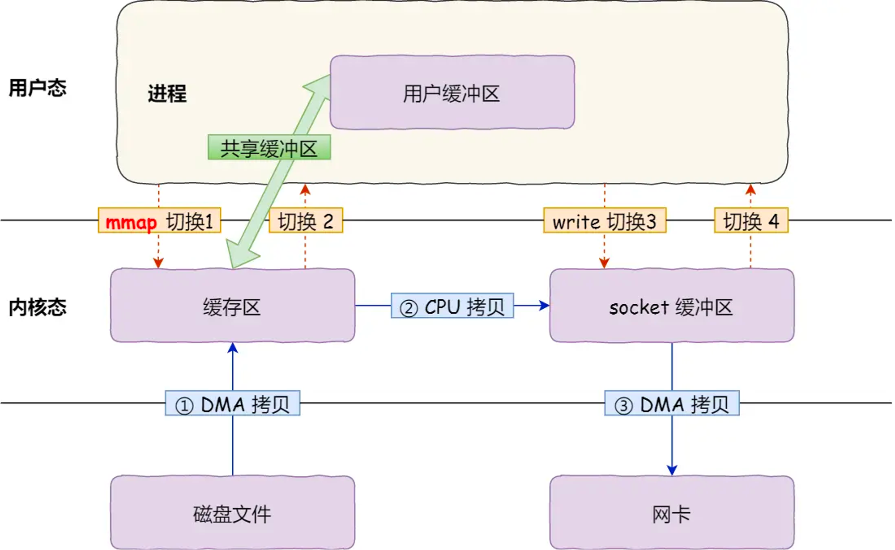
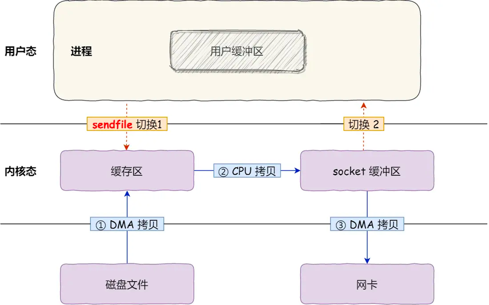
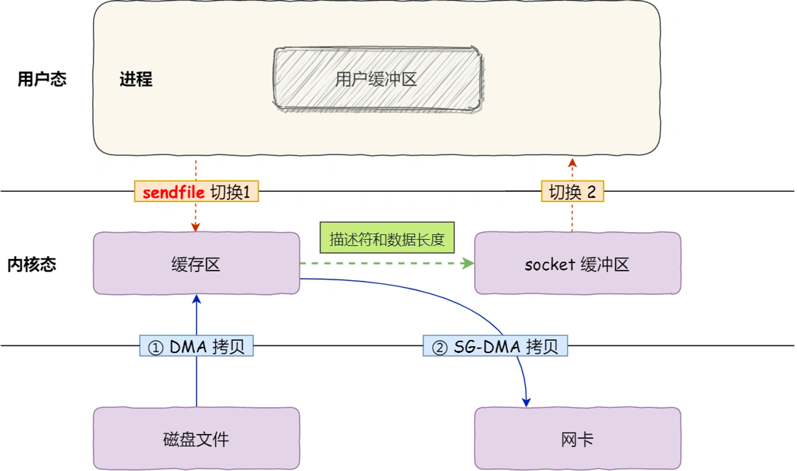

描述零拷贝的底层原理
<!-- more -->

## 一、问题背景
如何在磁盘IO成为性能瓶颈时，优化文件传输性能 ?

<!-- ## 二、磁盘优化
**磁盘优化**目的：提高系统吞吐量
操作系统内核中的 **磁盘高速缓存区(disk buffer)**，可有效减少磁盘的访问次数。

## 三、DMA 与 PageCache
### 3.1、DMA(Direct memory access)
**定义**：在进行 I/O 设备和内存的数据传输的时候，**数据搬运** 工作全部交给 **DMA控制器**，CPU 不再参与任何与数据搬运相关的事情，这样 CPU 就可以去处理别的事务。

### 3.2、PageCache(磁盘高速缓存)
操作系统使用 **PageCache** 缓存最近被访问的数据
PageCache主要有以下2个方面的**优点**：
1. 缓存最近被访问的数据
2. 预读 -->

## 二、传统文件传输
### 2.1、传统文件传输的问题
早期的IO操作(传统文件传输)，内存与磁盘的数据传输都是由CPU来完成的，而此时CPU不能执行其他任务，会特别浪费CPU。

**服务端** → **客户端 文件传输**
1. 4次「**用户态**」与「**内核态**」的上下文切换
2. 4次数据拷贝(2次DMA + 2次CPU拷贝)

### 2.2、可优化点
1. 减少「**用户态与内核态的上下文切换**」，即减少 **系统调用** 次数
2. 减少「**内存拷贝**」次数，**用户缓冲区** 在整个过程中是没有不必要存在的

## 三、零拷贝
零拷贝-实现方式：
1. mmap + write
2. sendfile
3. SG-DMA + sendfile

### 3.1、**mmap + write**

mmap系统调用会直接把内核缓冲区中的数据 **映射** 到 **用户空间**，这样 操作系统内核 和 **用户空间** 就不需要再进行任何的 **数据拷贝** 操作。

mmap替换read，可减少1次数据拷贝过程。

共需 **4次上下文切换 + 3次数据拷贝(2次DMA + 1次CPU拷贝)**。

### 3.2、sendfile

使用 **sendfile** 替代 read 和 write 两个系统调用，合并磁盘读取 + 网络发送两个操作，该系统调用可以直接把 **内核缓冲区** 中的数据拷贝至 **Socket缓冲区**，而无需拷贝至 **用户空间**。

sendfile 替换 read & write，可减少 2次上下文切换 以及 1次数据拷贝。

共需 **2次上下文切换 + 3次数据拷贝(2次DMA拷贝 + 1次CPU拷贝)**。

然而以上均不是真正的零拷贝技术。

### 3.3、真正的零拷贝

网卡支持 **SG-DMA技术**，可进一步减少通过CPU将 **内核缓冲区** 中的数据拷贝至 **Socket缓冲区** 的过程。

共需要 2次上下文切换 + 2次数据拷贝(**2次DMA拷贝**)

**SG-DMA + sendfile** 只需 **2次数据拷贝**，全程没有通过CPU来搬运数据，所有数据都是通过DMA传输。

**注意**：零拷贝技术不允许进程对文件内容做进一步加工。

<!-- ## 大文件传输
磁盘IO：
1. 直接I/O：绕开PageCache
2. 缓存I/O：使用PageCache

对磁盘而言，**异步I/O** 只支持 **直接I/O**。
传输 **大文件**，不能使用 **零拷贝**，因为可能由于PageCache被大文件占据，导致「**热点**」小文件无法利用到PageCache；同时，大文件的PageCache缓存命中率低。
因此，高并发场景下，针对 **大文件** 的传输方式，应该用「**异步I/O + 直接I/O**」替代 **零拷贝技术**，无阻塞地读取文件。 -->

## 四、零拷贝应用
1. 消息队列中间件 Kafka
2. 负载均衡中间件 Nginx

<!-- ## 数据传输实现总结
1. 传输 **大文件** 时，使用「异步I/O + 直接I/O」
2. 传输 **小文件** 时，使用「零拷贝技术」 -->

## 五、参考文献
1. https://xiaolincoding.com/os/8_network_system/zero_copy.html#_9-1-%E4%BB%80%E4%B9%88%E6%98%AF%E9%9B%B6%E6%8B%B7%E8%B4%9D