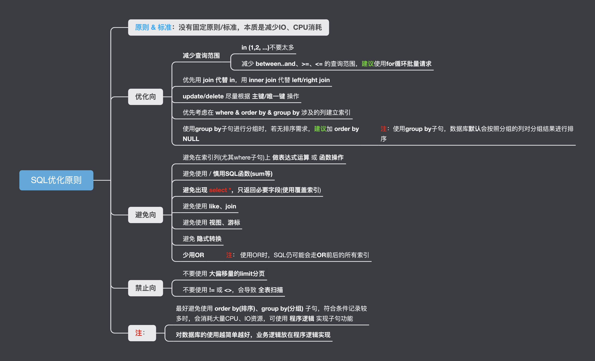

<!-- more -->

## 零、SQL优化-思维导图


## 一、SQL优化原则
核心优化原则/目标只有1条，**<font color="red">那就是尽可能简单的使用SQL语句，让MySQL存储引擎的计算/数据操作(e.g. SUM，MAX or group by/order by)尽可能少</font>**，尤其是在对性能要求非常苛刻的情况下，最好将 **计算逻辑/数据操作** 交给java/python/Go等程序语言来实现。
SQL优化的本质是减少机器的 IO 和 CPU 的资源消耗。


## 二、常见SQL优化方法
1. 优化业务逻辑，减少查询范围
    e.g. 
    1. IN关键字后的元素个数不要太多
    2. 范围查询 → 单次查询，转化为for训练批量请求
    3. DML尽量短小(Between … AND …)
2. 只返回必要字段(使用**覆盖索引**)，避免出现 **select *** 
3. 优先考虑在 **where** & **order by** 涉及的列建立索引
    应减少使用 **order by**：否则，若 **索引不合适** & **符合条件记录较多** 时，排序会消耗大量CPU、IO等资源，易引发性能问题
4. 避免在索引列上做 **运算(>、+、- 、=)** 或 使用 **SQL函数操作(SUM、MAX)**，**应使用java/python/Go程序实现SQL函数逻辑**
5. 避免使用 **like**
6. 避免使用 **join**
7. 优先用 JOIN 代替 IN 子查询
8. **update/delete** 尽量根据 **主键/唯一键** 操作
9. 避免 **隐式转换(类似于Java造型)**
    隐式转换会造成索引失效，常见情况: **int** 与 **string** 比较时发生；**字符串不加单引号** 会 隐式转换。
    SQL数量类型 **优先级由高到低**
    ```sql
    Datetime > Float > Int > Text > Varchar > Binary
    ```
10. 少用 **or(注: 使用OR的时候SQL可能仍然会走OR前后的所有索引)**
11. 不要使用大偏移量的**limit分页**(如果业务逻辑需要支持大偏移量的limit分页，参见[深分页问题](https://raysunwhut.github.io/system%20design/%E5%88%86%E9%A1%B5%E9%97%AE%E9%A2%98/%E6%B7%B1%E5%88%86%E9%A1%B5.html))
12. 使用 **!=** 或 **<>** 会导致全表扫描
13. 使用 **group by** 时，若无排序需求，建议加 **ORDER BY NULL**
14. 性能非常紧张时，最好不使用 **group by、distinct、order by** 等关键字，**使用java/python/Go程序实现数据操作逻辑**
14. 当已在where条件中正确使用索引 & 操作的数据量非常大时，使用 **GROUP BY/distinct/ORDER BY** 等仍然会产生额外的数据IO时间开销，导致数据库在处理大量数据时增加额外的计算成本，即使GROUP BY等操作在索引列上使用也不例外。故在性能非常紧张时，不要使用 **GROUP BY/distinct/ORDER BY** 等关键字，而是使用java/python/Go程序实现数据操作逻辑。


