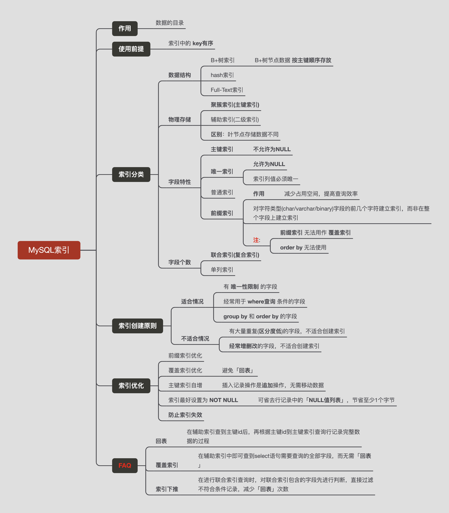
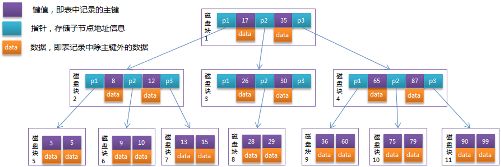
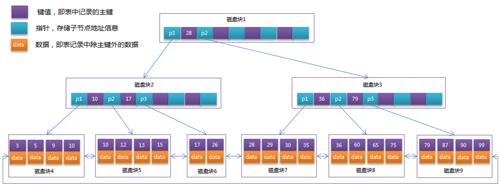
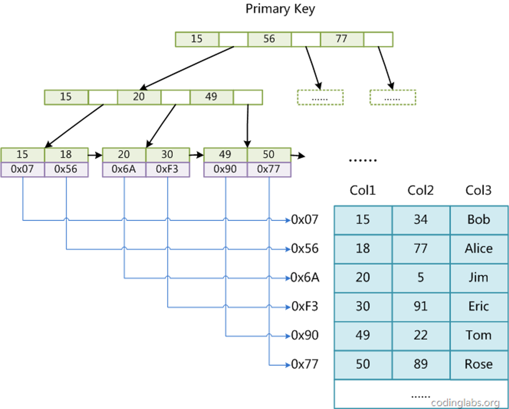
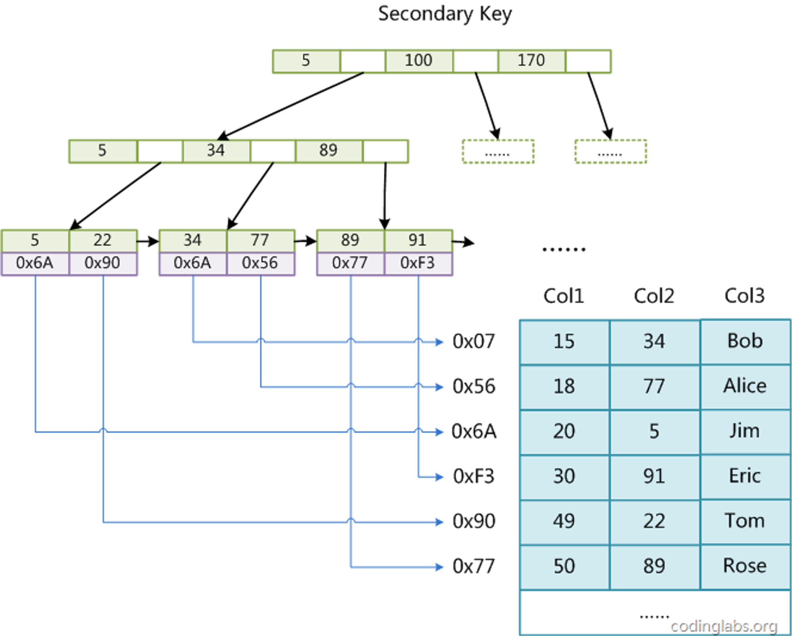
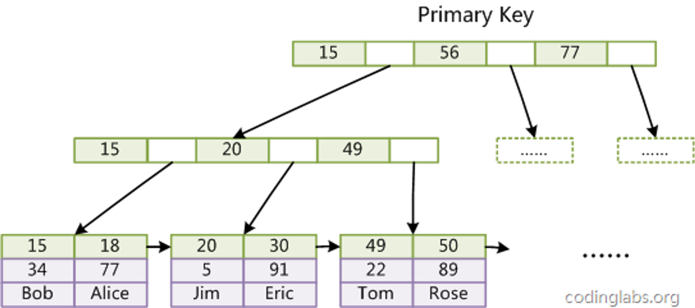
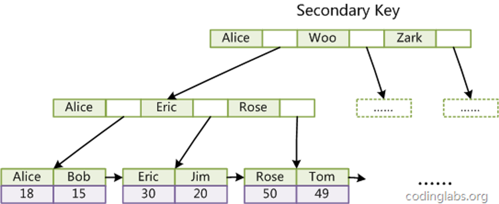
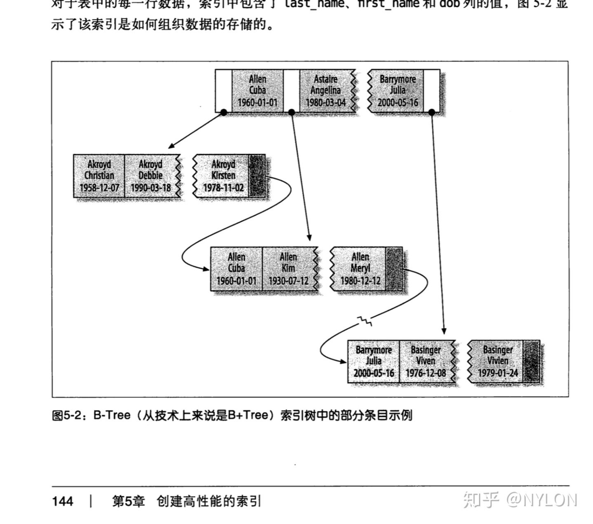
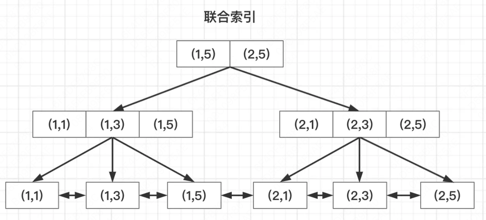
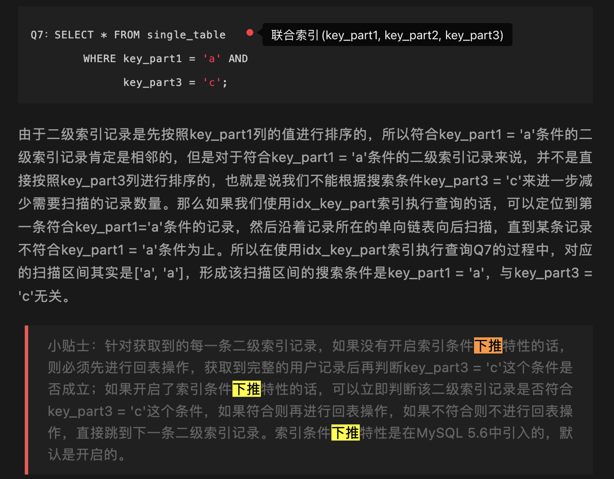

描述MySQL的索引结构、创建原则、优化实践经验
<!-- more -->

## 零、MySQL索引思维导图


## 一、基础概念
1. **操作系统-页(Page)**: 操作系统会将 **物理/虚拟内存** 分割成大小相等的 **页(Page)**，用于内存管理和分配。常见页(Page)大小通常为4KB、8KB等。
2. **MySQL-页(Page)**: MySQL中的页通常指的是InnoDB存储引擎中的**数据页**，每个数据页中包含多条 **行记录**。常见页(Page)大小为16KB。
3. **局部性原理**: 程序在访问某个数据/指令时，很可能会紧接着访问相邻的数据/指令。
4. **预读**: 根据"**局部性原理**"，操作系统常会在进行磁盘IO时，会进行"**预读**"；即1次磁盘IO操作不光会读取请求的目标数据块(block0)到内存，还会读取与目标数据块相邻的数据块(block1、block2)到内存，以提升数据访问效率。
5. **磁盘&内存IO速度差异**: <font color="red">**访问磁盘的IO成本是访问内存的十万倍左右**</font>


## 二、索引分类
### 2.1、按 **存储类型** 划分
  InnoDB中B+树索引可以分为**聚集索引** 和 **辅助索引**，区别在于 **叶子结点存储的是否是完整的行记录**。
1. 主键索引(**聚集索引**)
  聚集索引 按照表的 **主键(PK)** 构造一棵B+树，**叶子结点** 存储一条完整的行记录，聚集索引的 1个**叶子结点** 就是MySQL的 1个**数据页**；同时，每个 **叶子结点** 之间都通过 **双向链表** 进行连接。
  因此，使用主键索引执行 **主键排序** 和 **主键范围查找** 的速度很快。
2. 二级索引(**辅助索引**)
  二级索引 按照 **用户指定列(单/多列)** 构造一棵B+树，叶子结点只存储一条行记录的部分数据(主键(PK) + 用户指定列)，存储引擎会先在辅助索引中定位到具体的叶子结点，然后获取到叶子结点中存储的**主键(PK)**值，最后，再通过**回表**(如有必要)，在**主键索引**获取到一条完整的行记录。
### 2.2、按 **功能** 划分
1. 普通索引
2. 唯一索引(unique index)
3. 复合(联合)索引: 区分度越高的列越应该放在前面，**最左匹配原则(索引创建原则)**
4. 前缀索引
5. 虚拟列索引
### 2.3、回表 & 覆盖索引
1. **回表**
  指通过辅助索引无法查询到本次要查询的所有字段，则根据辅助索引叶子结点中的主键(PK)值，再到主键索引中进行一次查询，获取到叶子结点的一条完整的行记录。这个操作称为「**回表**」。
2. **覆盖索引**
  覆盖索引是一种 **数据查询方式**，不是具体的哪一类索引。若辅助索引中包含本次查询的所有字段，只通过 **辅助索引** 就能拿到结果，而 无需「**回表**」。则称本次查询使用了**覆盖索引**。

```sql
-- 建立复合索引(name, age)
CREATE INDEX idx_name_age ON user(username, age);

-- 覆盖索引查询: 要查询的字段均存在于索引树结点的数据项中
select username, age from user where username = 'lihua';

-- phone_number列值不在 idx_name_age复合索引中, 故需「回表」
select username, age, phone_number from user where username = 'lihua';
```

## 三、索引结构
下面分析几种索引结构的差异。
### 3.1、Hash索引
InnoDB中支持的Hash索引是 **自适应的**，InnoDB会根据表的使用情况自动为表生成 **Hash索引**；不能人为干预是否在一张表中生成 **Hash索引**。InnoDB会监控对表上辅助索引的查找，若发现某辅助索引被频繁访问，则辅助索引会成为热🔥数据；并建立哈希索引，提升访问速度。

**特点**:
1. 无序，无树高
2. 降低对辅助索引的访问频次
3. 自适应

**缺点**:
1. 会占用 InnoDB buffer pool 资源
2. 仅支持等值查询，**不支持范围查找**
3. 无法用于排序
4. 有冲突可能

### 3.2、B树索引

1. 所有键值分布在整个树中
2. 任何关键字出现且只出现在一个节点中
3. 搜索有可能在非叶子节点结束
4. 在关键字全集内做一次查找，性能逼近二分查找算法



**B+树与B树的不同**
（1）B+树将完整行记录存储在叶子节点，非叶子节点只存储索引结点数据。
（2）B+树的叶子节点之间使用双向链表进行连接。

### 3.3、B+树索引
1. B+树的每个结点都是1个InnoDB页
2. 只有叶子结点存储真实数据，非叶子结点存储指针(非真实数据)
    因为1页磁盘块大小固定，因此一旦把真实数据放到非叶子结点，那么树高势必会增加；这也是为什么索引字段应该尽量小的原因
3. **1次IO操作** 读取 **1个B+树结点**(即，**1个操作系统-页(Page)**)
4. IO次数取决于B+树的**高度h**，若当前表的数据大小为**N**，1页磁盘块的数据项的数量为**m**，则 **树高** 为 $h=log_{m+1}^{N}$；当数据量**N**一定时，m越大，h越小
5. **索引的最左匹配特性**
    若B+树的索引结构为 **复合索引**(e.g. id, name, age)；则B+树会**按照从左至右顺序建树**，只有先确定id，才能确定name；若查询条件只有(id, age)，则索引会在id匹配完后停止匹配



## 四、不同存储引擎下的索引结构
### 4.1、MyISAM引擎
MyISAM引擎下，表可以没有主键。
#### 4.1.1、聚集索引
MyISAM引擎使用B+Tree作为索引结构，**叶子节点的data域**存放的是**数据记录的地址**。


#### 4.1.2、辅助索引
在MyISAM中，主索引和辅助索引在结构上没有任何区别，只是 主索引要求key是唯一的，而辅助索引的key可以重复。


### 4.2、InnoDB引擎
InnoDB要求 表必须有主键。

#### 4.2.1、聚集索引
**<font color="red">InnoDB的数据文件本身就是 聚集索引 文件</font>**，叶子节点的data域包含 **完整的行记录数据**。


#### 4.2.2、辅助索引
InnoDB的辅助索引，引用主键(PK)作为**叶子结点的data域**。


### 4.3、InnoDB和MyISAM引擎区别
1. **主键(PK)**
    1. MySQL引擎 表必须有索引
    2. MyISAM引擎 表可以没有索引
2. **索引**
    1. 聚集索引：
        1. **InnoDB引擎 数据文件本身就是索引文件**
        2. **MyISAM引擎 索引和数据是分开的**
    2. 辅助索引：
        1. InnoDB的辅助索引data域存储相应记录主键的值而不是地址
        2. MyISAM的辅助索引和主索引没有多大区别

## 五、FAQ
### 5.1、复合(联合)索引是如何构建B+树的?
ans: 下图出自《**高性能MySQL 3rd Edition**》


e.g. 表结构 为(a int, b int, c int)，索引结构 为(a, b)，则联合索引结构如下。


### 5.2、索引与索引个数的关系?
ans: 
  1. 建立复合索引只会建立1棵B+树，若复合索引顺序 或 字段不同，则会建立多棵B+树。
  2. 多个列分别建立索引，则每个列会分别建立一棵B+树，有几个列就有几个B+树。

### 5.3、索引下推是什么?
ans: 在有限范围内进行比较，减少回表次数。


### 5.4、SQL字符串如何比较大小?
ans: 从字符串的第一个字符开始比较ASCII码值，如果相等则看下一个，以此类推; **小写字母**的ASCII码 > **大写字母**的ASCII码 > **数字** 的ASCII码。

## 六、参考文献
1. https://zhuanlan.zhihu.com/p/447472435
2. https://blog.csdn.net/m0_49161353/article/details/120270845
3. https://www.cs.usfca.edu/~galles/visualization/BPlusTree.html
4. https://dev.mysql.com/doc/refman/5.7/en/index-merge-optimization.html
5. https://mp.weixin.qq.com/s/iVDIlhM94loH0b632fhJxw?poc_token=HOFQaWajEzk8t18tSgOpWJ37A40IBQcqZJB6foMb
6. https://juejin.cn/post/6844903921450745863
7. https://tech.meituan.com/2014/08/20/innodb-lock.html
8. https://www.aneasystone.com/archives/2017/12/solving-dead-locks-three.html
9. http://blog.codinglabs.org/articles/theory-of-mysql-index.html
10. https://juejin.cn/post/6844904073955639304
11. https://www.cs.usfca.edu/~galles/visualization/Algorithms.html
12. https://juejin.cn/post/7129490960169304095


