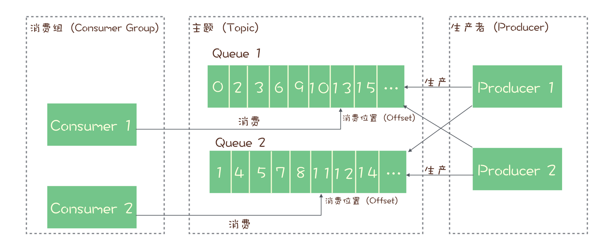
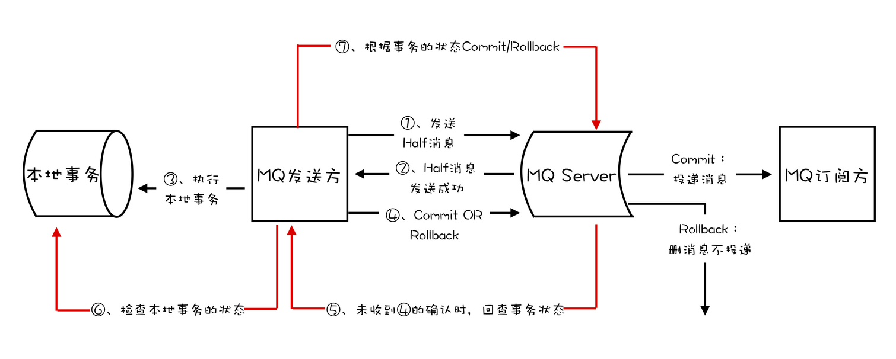
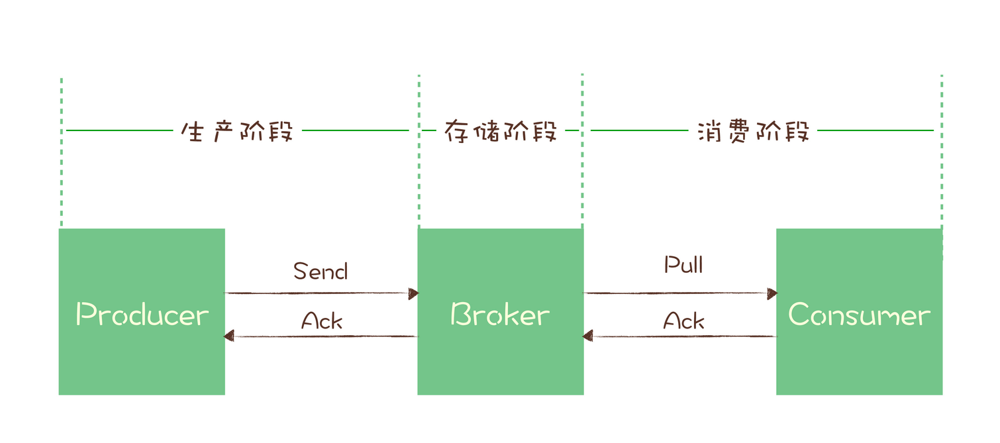

MQ基础知识、概念整理
<!-- more -->

## MQ使用场景
1. 异步处理
2. 流量控制
3. 服务解耦

**MQ缺点**: 
1. 增加延迟
2. 增加系统复杂度
3. 可能产生数据不一致问题

## MQ主流产品
### 第一梯队
1. **RabbitMQ**
   1. **优点**
       1. **开箱即用(轻量级)**
       2. Exchange模块(交换机)，支持路由配置
       3. 客户端支持最多的编程语言
       4. 支持AMQP协议
   2. **缺点**
       1. 对消息积压支持不好，大量消息积压时性能急剧下降
       2. **性能最差(几万～十几万/秒)**
       3. 开发语言Erlang学习曲线陡峭
2. **RocketMQ**
   1. **优点**：
       1. 性能(几十万/秒)、稳定性和可靠性都不错
       2. 响应时延低(低延迟)
       3. 金融级稳定性
       4. 适合 **在线业务**
   2. **缺点**：
       1. **周边生态系统相对较差**
3. **Kafka**
   1. **优点**：
       1. **周边生态系统兼容性最好**！
       2. **异步收发性能最好(吞吐量高)**！
       3. 适合**日志、监控、大数据、流计算**
   2. **缺点**：
       1. **同步响应时延较高**(攒一波再发送/处理)
       2. **不太适合在线业务**

### 第二梯队
1. **ActiveMQ**
    最老牌消息队列，仅用于兼容旧系统
2. **ZeroMQ**
    更适合称为“基于消息队列的多线程网络库”
3. **Pulsar**
    特点: 存储 & 计算分离

## 消息模型
### 队列模型
任何一条消息只能被其中的一个消费者收到

### 发布-订阅模型(Publish-Subscribe Pattern)
与队列模型**最大区别**：一份消息数据能不能被消费多次的问题

## RabbitMQ消息模型
使用 **队列模型**，通过 **Exchange模块** 实现发布-订阅模型功能。

See Detail

使用 队列模型，通过 Exchange模块 实现 “发布-订阅模型” 中 “一份数据可被多个订阅者消费的的功能”。

Exchange模块决定将消息投递到哪个队列中，若同一份消息有多个消费者，则Exchange模块会将消息发送至多个队列。

## RocketMQ/Kafka消息模型
使用 **发布-订阅模型**

每个 **主题(Topic)** 包含多个**队列(Queue)/分区(Partition)**，通过多个队列来实现多实例并行生产和消费。

消息有序性：只能保证 **队列层面** 的消息有序性，主题层面**无法保证**消息严格有序。

消息可靠性：**“请求-确认”机制**。

**生产** 和 **消费** 过程中，分别有1次请求-确认机制。

## 消息队列基本概念

- **生产者(Producer): 发布者(Publisher)**
- **消费组(Consumer Group): 订阅者(Subscriber)**
   1. 每个 **消费组(Consumer Group)** 都消费 **主题(Topic)** 中一份完整的消息(所有队列的全部消息)，不同消费组之间消费进度不受影响
   2. 一个消费组中包含多个 **消费者(Consumer)实例**，同一组内的消费者是竞争消费关系
   3. 同一消费组在每个队列上只能串行消费，多个队列加在一起就是并行消费，**并行度**就是队列数量
   4. 某个队列在同一消费组中最多只能由一个消费者实例占用
   5. 接4，**分区 → 消费者: 1 : 1，消费者 → 分区: 1 : N**
   6. Consumer Group 对应 Topic，Consumer对应Queue
- **消费者(Consumer):** 消费组下的消费实例
- **消费位置(Consumer Offset)**: 记录消费组在当前队列的消费位置
   1. 每个消费组在每个队列上维护一个消费位置(**注**: 消费位置和消费者无关)
   2. 消费位置一般保存在Broker中(RocketMQ/Kafka)
- **主题(Topic):** 服务端存放消息的容器
- **队列(Queue)/分区(Partition):** 一个主题包含多个队列/分区，通过队列/分区实现多实例并行生产和消费
- **服务端(Broker):** 存储队列的服务器

## 分布式事务
常见分布式事务实现
1. 两阶段提交-2PC(Two-phase Commit)
2. TCC(Try-Confirm-Cancel)
3. 事务消息

消息队列通过 **事务消息** 实现分布式事务。

**步骤4** 提交/回滚失败处理方案

1. Kafka会直接抛出异常，用户自行解决，重试 or 其他。
2. RocketMQ增加 **事务反查机制** 解决(业务代码提供反查接口)。

## **消息丢失 & 重复 & 积压**
### **消息丢失处理(消息可靠性传递)**
#### **检测消息丢失的方法**
利用消息队列的 **有序性** 验证是否有消息丢失(使用 **拦截器机制**)

**注**：
1. 多实例Producer，则每个Producer生成各自消息序号(带Producer标识)
2. 需指定队列/分区(Partition)，每个分区单独检测
3. Consumer端按Producer检测序号连续性，Consumer实例数要与分区数量一致

#### **消息生产-消费流程**

- **生产阶段**
    编写发送消息代码时，正确处理返回值或捕捉异常，即可保证消息不丢失
- **存储阶段**
    将消息写入磁盘后，再给Producer返回确认响应
    多Broker节点集群，则需至少将消息发送到2个以上节点，再给Producer返回响应
- **消费阶段**
    执行完消费逻辑后，再返回消费确认响应

## **重复消息处理**

**消息重复不可避免**, 服务质量标准：
1. **At most once**：至多一次(消息最多送达一次)，没有消息可靠性保证，允许丢消息
2. **At least once**：至少一次，不允许丢失消息，但允许少量重复消息出现
3. **Exactly once**：恰好一次，只会被送达一次，不允许丢失 & 重复

### **使用幂等性解决重复消息问题**
**At least once + 幂等消费 = Exactly once**

### **幂等消费实现方式**
从消费业务逻辑设计入手，将 **消费业务逻辑** 设计成具备幂等性的操作，包括
1. 设置数据库唯一约束(**unique key**)
2. 为更新的数据设置前置条件(增加 **版本号属性**)
3. 记录并检查操作(Token机制 或 GUID) **，一般不建议使用**

## **消息积压处理**
### **优化性能**
发送端：增加批量(提高吞吐量)、提高并发(降低时延)
消费端：
1. 系统设计时，保证消费性能高于生产端发送性能
2. **水平扩容**，增加consumer实例，并与 **队列/分区(Partition)** 数量保持一致

### **问题排查**
问题：排查是否是**消费失败(如消息格式异常)导致的一条消息反复消费**的情况 ?
解决方案：消息队列中间件提供 “**死信队列**” 功能，自动把反复消费失败的消息丢到死信队列中，避免一条消息卡住队列。

# FAQ
## 1、单个队列并行消费如何实现 ?
此时，将 **队列 : 消费者** 置成 **1 : N** 即可。

问题：消息空洞(e.g. 3个消费者实例读1个队列(Queue)中的5、6、7三条消息，**6、7 ACK** 返回但 **5 ACK** 未返回)

解决方案：消息队列中间件提供 “**重试队列**” 功能，将5这条消息复制到重试队列，更新消费位置为8，继续消费。下次拉消息时，优先把重试队列中的消息给消费者。

## 2、如何保证消息的严格顺序 ？
**全局严格顺序**：将队列数置为1即可。
**局部严格顺序**：通过一致性哈希算法指定队列发送消息实现。

# 参考文献
1. http://juconcurrent.com/books-jksj-71-80/
2. https://cwiki.apache.org/confluence/display/KAFKA/Kafka+Improvement+Proposals
3. https://kafka.apache.org/documentation/#introduction
