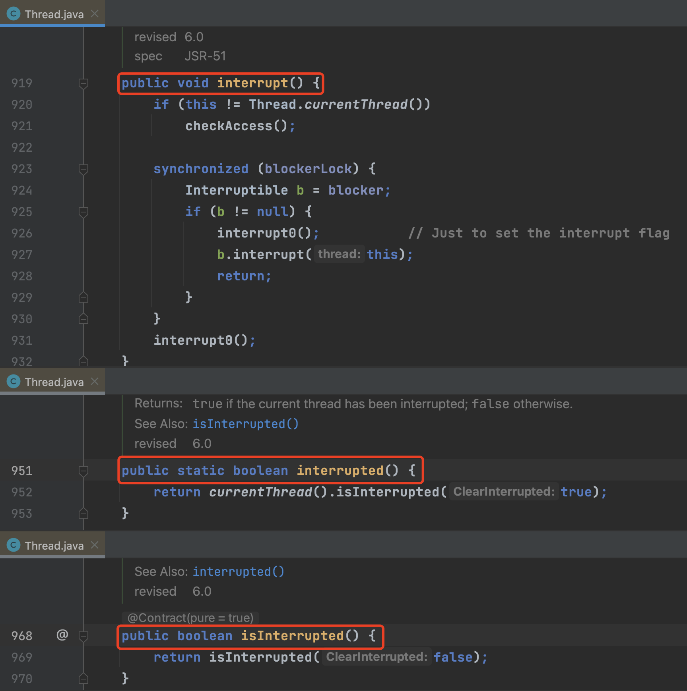
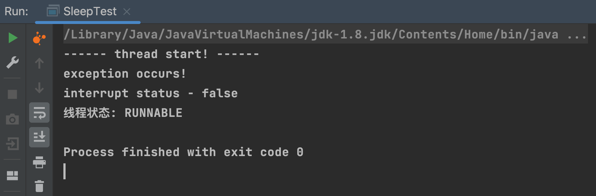
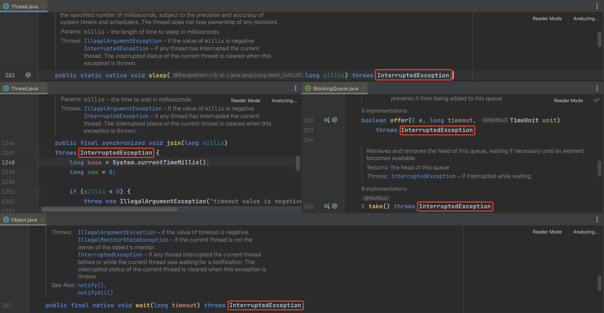
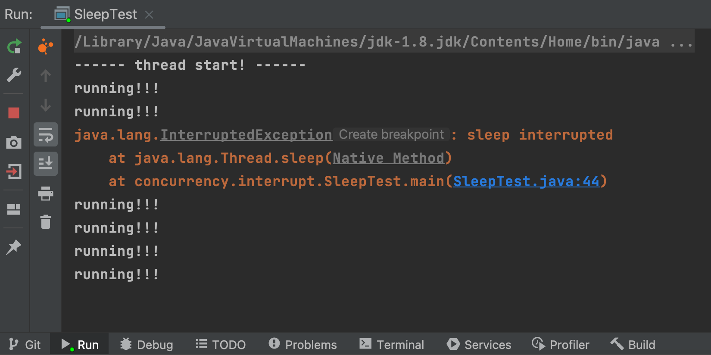
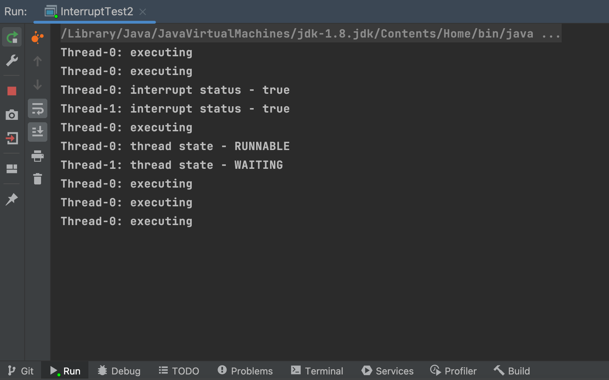
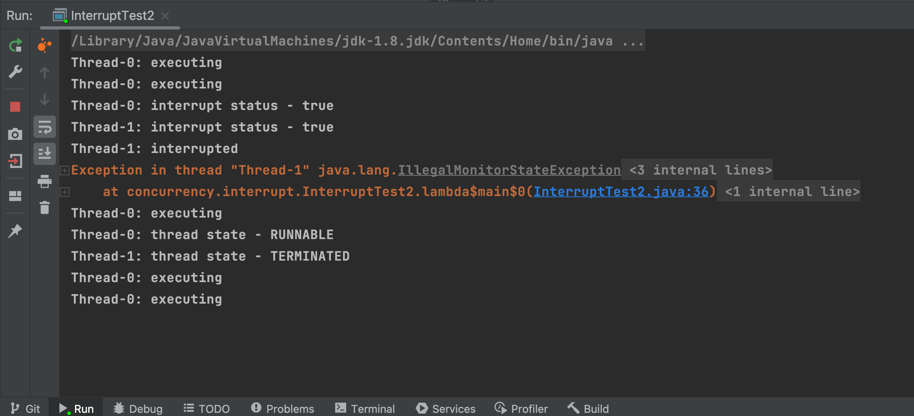

分析java线程中断的作用、使用场景以及处理原则
<!-- more -->

## **线程中断机制-知识图谱**


## **线程中断处理方法**
Thread类中有3个与线程中断有关的方法: 
- **`interrupt()`**: 唯一一个可将线程 **中断标识** 置为 **true** 的方法
- **`isInterrupted()`**: 返回线程 **中断标识**。
- **`interrupted()`**: 返回线程 **中断标识**，并 **清除** 线程中断标识(即若当前线程被中断，且中断标识为 **true**，则调用 **`interrupted()`** 方法后，会返回 **true**，同时将线程中断标识置为 **false**)。




## **中断(Interrupt)作用**
Java语言中的 **中断(Interrupt)** 与中文语境中中断的含义略有不同；在Java语言中，线程 **中断(Interrupt)** 并不是真正的将某个运行中的线程终止，**中断(Interrupt)的作用** 更接近于 **协调** 和 **通知**；至于收到中断信号的线程如何响应(终止、继续执行 或 挂起等)，由被中断线程自己决定。

**程序示例**
```java
public class SleepTest {
    public static void main(String[] args) {
        Thread c = Thread.currentThread();

        Thread t = new Thread(() -> {
            try {
               // 此处sleep()只起阻塞作用, 也可替换成空转的for消除try..catch语句
                Thread.sleep(2000L);
                c.interrupt();
            } catch (InterruptedException e) {
                throw new RuntimeException(e);
            }
        });
        t.start();

        System.out.println("------ thread start! ------");

        // 实践证明：interrupt()方法只会将线程的中断标识置为true, 无法终止线程运行，只起协同(通知)作用，具体执行怎样的逻辑，取决于代码对中断的响应
        try {
            Thread.sleep(3000L);
        } catch (InterruptedException e) {
            System.out.println("exception occurs!");
            // 注: 抛出InterruptedException异常后，中断标识会被置为false
            System.out.println("interrupt status - " + c.isInterrupted());
//            throw new RuntimeException(e);
        }

        System.out.println("线程状态: " + Thread.currentThread().getState());
}

```


可以看到 Thread.sleep() 方法会可以感知中断，并抛出**InterruptedException异常**，
其他会抛出 **InterruptedException异常** 的方法包括但不限于:
- **`wait()`**
- **`sleep()`**
- **`join()`**
- **`offer()`**
- **`take()`**


<font color="#C3002E"><b>注</b></font>: 凡是在方法声明中抛出 **InterruptedException异常** 的方法，均可感知到中断标识变化，并会在线程中断标识发生变化 **(置为true)** 后，抛出 **InterruptedException异常**。
需要特别说明，抛出 **InterruptedException异常** 后，中断标识会被清除(重置为 **false**)。

## **中断处理原则**
1. **响应中断**
   1. **显示响应**
      程序逻辑中使用 **isInterrupted()**、**interrupted()** 方法判断中断标识，执行响应逻辑。
   2. **隐式响应**
      方法声明中包含 **throws InterruptedException** 的方法会自动响应中断。
2. **传递中断**
   当其他线程调用另一个线程的 **interrupt()** 方法中断它时，应该将中断传递给被中断线程。
  处理方法: 
   1. 继续向⽅法调⽤栈的上层抛出 **InterruptedException异常** 传递中断
   2. 重新设置线程中断标识(使用**interrupt()**) 传递中断
1. **避免忽略中断**
  程序中捕获的**InterruptedException中断异常**, 不应被吞掉。
  程序示例
    ```java
    public class SleepTest {
        public static void main(String[] args) {
            Thread c = Thread.currentThread();

            Thread t = new Thread(() -> {
                try {
                    Thread.sleep(2000L);
                    c.interrupt();
                } catch (InterruptedException e) {
                    throw new RuntimeException(e);
                }
            });
            t.start();
            System.out.println("------ thread start! ------");

            // 测试 printStackTrace()方法 是否会吞掉异常
            while(true) {
                System.out.println("running!!!");
                if (c.isInterrupted()) {
                    break;
                }

                try {
                    // 当线程被阻塞在 sleep()/join()/wait() 这些方法时, 如果被中断, 就会抛出 InterruptedException 受检异常，
                    // 并且，当前线程的中断标识会被清除(置为false)
                    Thread.sleep(1000L);
                } catch (InterruptedException e) {
                    // printStackTrace()会吞掉异常
                    e.printStackTrace();
                    
                    // 方法1: 重置中断标识
                    // c.interrupt();

                    // 方法2: 向⽅法调⽤栈的上层抛出受检异常
    //                throw new RuntimeException(e);
                }
            }
        }
    }
    ```


程序catch到受检异常InterruptedException后，执行 `e.printStackTrace()` 语句后吞掉了异常，导致出现while死循环。

<font color="#C3002E"><b>注</b></font>: 程序中捕获的任何受检异常都不应该被吞掉，否则会导致上层调⽤栈什么信息也获取不到。

## **FAQ**
**Q**: 抛出 InterruptedException 异常后，中断标识就⼀定被清除(置为**false**)吗 ？
**ans**: 是的，线程中断标识一定会被清空。

**Q**: 处在死锁状态的线程是否可以被中断 ?
**ans**: 处于死锁状态的线程无法直接被中断。

**Q**: 已进⼊临界区的线程能否被中断 ?
**ans**: 已进入临界区的线程无法被直接中断。
**程序示例**
```java
public class InterruptTest2 {
    private static final ReentrantLock lock = new ReentrantLock();

    public static void main(String[] args) throws InterruptedException {
        List<Thread> list = new ArrayList<>();

        int sum = 2;
        for (int i = 0; i < sum; i++) {
            Thread thread = new Thread(() -> {
                String name = Thread.currentThread().getName();

                // 尝试获取锁，不可响应中断
                lock.lock();
                try {
                    // 执行临界区操作
                    while (true) {
                        // lock()方法虽然不可响应中断, 但可以使用isInterrupted()方法判断中断状态, 显示处理中断
//                        if (Thread.currentThread().isInterrupted()) {
//                            System.out.println("break!!!");
//                            break;
//                        }

                        System.out.println(name + ": executing");
                        for (int k = 0; k < Integer.MAX_VALUE; k++)
                            for (int l = 0; l < Integer.MAX_VALUE; l++);
                    }
                } finally {
                    // 退出临界区，释放锁
                    lock.unlock();
                }
            });
            thread.start();
            list.add(thread);
        }


        Thread.sleep(2000L);
        for (int i = 0; i < sum; i++) {
            // 中断线程
            list.get(i).interrupt();
            System.out.println(list.get(i).getName() + ": interrupt status - " + list.get(i).isInterrupted());
        }

        Thread.sleep(1000L);
        for (int i = 0; i < sum; i++) {
            System.out.println(list.get(i).getName() + ": thread state - " + list.get(i).getState());
        }
    }
}
```



可以看到，**已进入临界区的程序，无法响应中断**，但可以在临界区程序中使用 **isInterrupted()** 等方法判断中断状态, **显示处理中断**。

**Q**: 如果已进⼊临界区的线程不能被中断，有什么办法可以响应中断吗? 
**ans**: 
如果希望正在等待锁(acquiring)、等待 I/O 操作或处于睡眠状态的线程 **响应中断**，可以使用可重入锁(ReentrantLock)的 **lock.lockInterruptibly()** 方法；使用 **lock.lockInterruptibly()** 方法可以让正在阻塞等待获取锁(acquiring)的线程响应中断，抛出InterruptedException受检异常。
**程序示例**
```java
public class InterruptTest2 {
    private static final ReentrantLock lock = new ReentrantLock();

    public static void main(String[] args) throws InterruptedException {
        List<Thread> list = new ArrayList<>();

        int sum = 2;
        for (int i = 0; i < sum; i++) {
            Thread thread = new Thread(() -> {
                String name = Thread.currentThread().getName();
                try {
                    // 尝试获取锁，可响应中断
                    lock.lockInterruptibly();
                    // 执行临界区操作
                    while (true) {
                        System.out.println(name + ": executing");
                        for (int k = 0; k < Integer.MAX_VALUE; k++)
                            for (int m = 0; m < Integer.MAX_VALUE; m++);
                    }
                } catch (InterruptedException e) {
                    System.out.println(name + ": interrupted");
                    throw new RuntimeException(e);
                } finally {
                    // 退出临界区，释放锁
                    lock.unlock();
                }

            });
            thread.start();
            list.add(thread);
        }


        Thread.sleep(2000L);
        for (int i = 0; i < sum; i++) {
            // 中断线程
            list.get(i).interrupt();
            System.out.println(list.get(i).getName() + ": interrupt status - " + list.get(i).isInterrupted());
        }

        Thread.sleep(1000L);
        for (int i = 0; i < sum; i++) {
            System.out.println(list.get(i).getName() + ": thread state - " + list.get(i).getState());
        }
    }
}
```



## 参考文献
1. https://dayarch.top/p/java-concurrency-book.html


