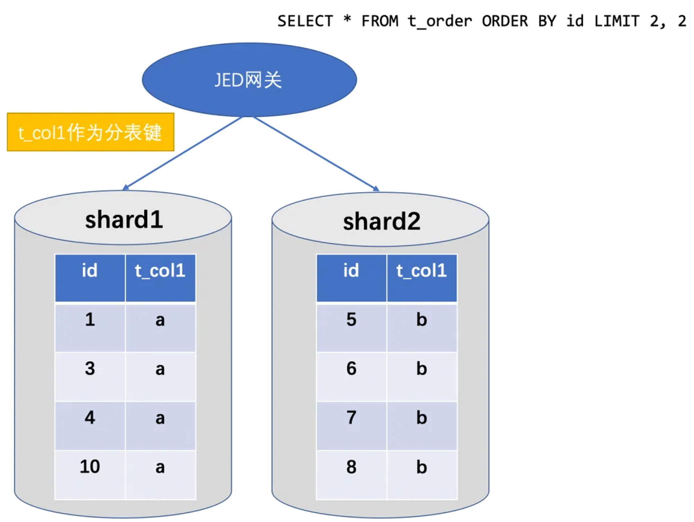
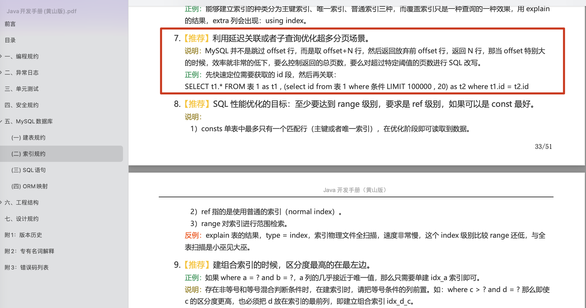

描述MySQL深分页问题&解决方案
<!-- more -->

## 一、问题描述
**浅分页-定义**：当offset值较小时，执行分页查询的SQL语句称为 “**浅分页**”
**深分页-定义**：当SQL分页查询的 **偏移量(OFFSET)** 较大的时，会导致数据库出现 **性能瓶颈(OOM)**
故，将 **查询偏移量(OFFSET)过大** 的场景称为 ”**深分页**”
**e.g.** 
```sql
-- 注: limit & offset 语法: limit offset, pageSize <=> limit ? offset ?
-- e.g. limit 100000, 10 <=>(等价于) limit 10 offset 100000
-- 排序字段要加索引/是索引列
SELECT * FROM t_order ORDER BY id LIMIT 1000000, 10
```

## 二、分页问题优化前提
分页场景下必须加 order by，且order by的字段，必须是 索引列，否则无论怎样优化SQL，查询性能都很难提升

## 三、分布式场景下的分页查询
分布式场景下，由于数据存在于多个 **分表** 之中，当执行 **分页查询** 时，需要将 **分页SQL语句** 下推到各个MySQL实例的分表中执行，再在内存中聚合排序各分表的查询结果，最后返回。

但是，为了保证分页查询数据的正确性，需要 **改写分页SQL语句**。

e.g.
```sql
-- 原分页SQL语句
-- 原执行结果{(id: 4, t_col1: a), (id: 7, t_col1: b)}❌
select * from t_order order by id limit 2, 2;

-- 改写后的分页SQL语句
-- 原执行结果{(id: 1, t_col1: a), (id: 3, t_col1: b)}✅
select * from t_order order by id limit 0, 4;

-- 再比如,
-- 单机单表 场景
SELECT * FROM t_order ORDER BY id LIMIT 1000000, 10
-- 多MySQL实例&多分表 场景
-- 改写后的正确SQL
SELECT * FROM t_order ORDER BY id LIMIT 0, 1000010
```



## 四、深分页优化

### 4.1、表主键id连续
当可保证 **id的连续性** 时，可根据 **id范围** 进行 **分页**

```sql
SELECT * FROM t_order WHERE id >= 100001 AND id <= 100010 ORDER BY id
```

### 4.2、带 {last_条件} 查询
**具体实现**：可通过 **记录上次查询结果** 的**最后1条记录**的**id** 进行 **分页查询**(需要配合程序逻辑实现)
**场景限制**：不支持 **跳页**(即 通过点击页码数字跳转)
**推荐使用场景**：**没有页码，滑动加载下一页，只有上/下一页按钮** 的应用

```sql
SELECT * FROM t_order WHERE id >= #{last_id} LIMIT 10
```

### 4.3、子查询
将查询条件转移到 **主键索引**，由于子查询中select选出字段只有 **主键列(id)**，故 **使用了覆盖索引**，**减少了回表次数**，进而**减少了大量IO操作**。

京东解法: **子查询改造**，可一定程度上降低OOM概率
**<font color="red">注</font>**：个人认为不够好，不如一次性在子查询中将满足偏移量的所有id全查出来，而不是仅在子查询已经定位到满足offset的第一条记录的id后，就直接返回；然后再交给主表，使用 >= 再定位查找1遍，这种做法 **没有充分利用好子查询的定位/查询结果**

```sql
# 原SQL
SELECT * FROM t_order ORDER BY id LIMIT 1000000, 10

# 子查询改造
SELECT * FROM t_order WHERE id > (SELECT id FROM t_order order by id limit 1000000, 1) 
LIMIT 10;
```

**<font color="red">注</font>**：京东认为，此方案数据查询量级较大时，仍然有OOM风险，故建议子查询只作为应急过渡方案.

### 4.4、级联子查询
阿里巴巴java开发手册-关于深分页问题的解法
使用 **子查询 + 覆盖索引** 在 **最小化** **回表次数** **+** **IO操作次数** 的情况下，查出符合条件的主键(id)值，然后再与 **SELECT * 的SQL查询** 做级联，查出符合条件的**SQL语句**。


**<font color="red">注</font>**：**得物**官方使用此方案解决深分页问题，详见[此处](https://juejin.cn/post/6985478936683610149)

```sql
-- 注：以下2条SQL等价
SELECT t1.* FROM t_order AS t1 
INNER JOIN 
(SELECT id FROM t_order ORDER BY id LIMIT 100000 , 20) AS t2 
ON t1.id = t2.id

SELECT t1.* FROM t_order AS t1 , 
(SELECT id FROM t_order ORDER BY id LIMIT 100000 , 20) AS t2 
WHERE t1.id = t2.id
```


## 五、参考文献
1. https://mp.weixin.qq.com/s/ZEwGKvRCyvAgGlmeseAS7g
2. https://juejin.cn/post/6985478936683610149
3. https://javaguide.cn/high-performance/deep-pagination-optimization.html#%E5%AD%90%E6%9F%A5%E8%AF%A2